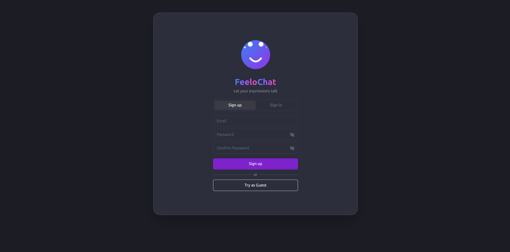
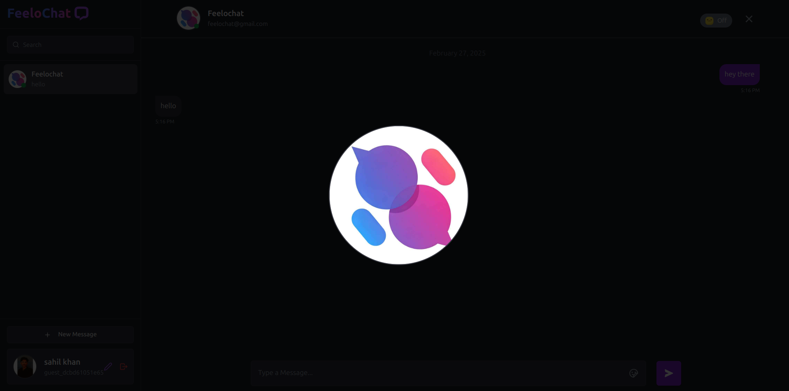
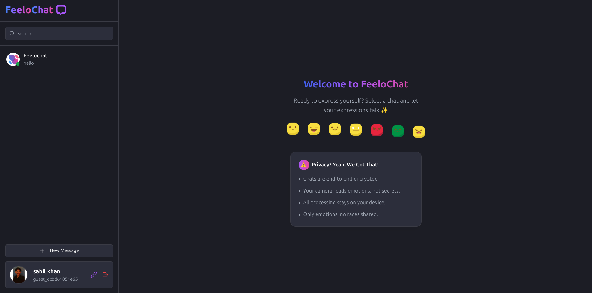
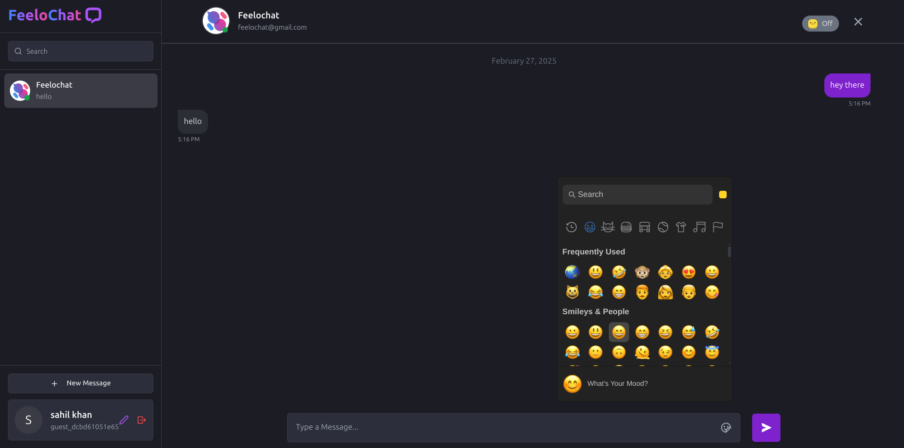
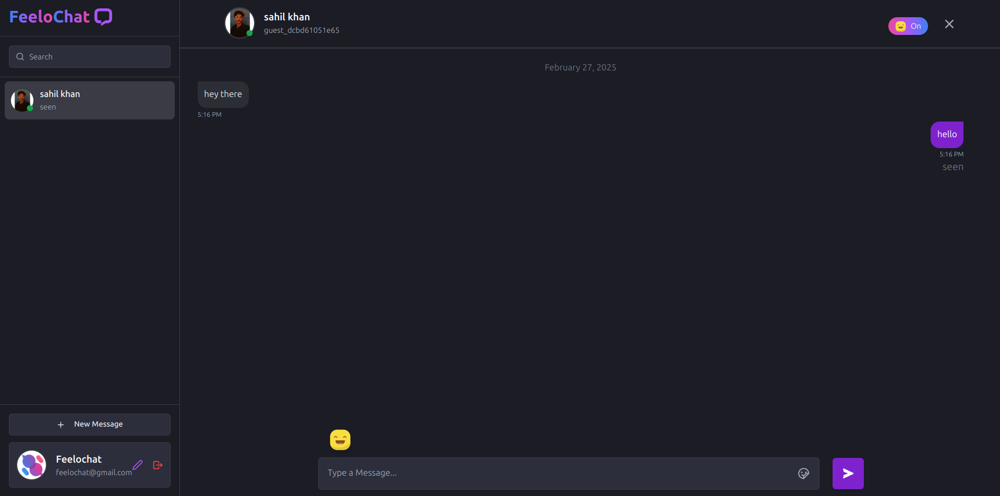
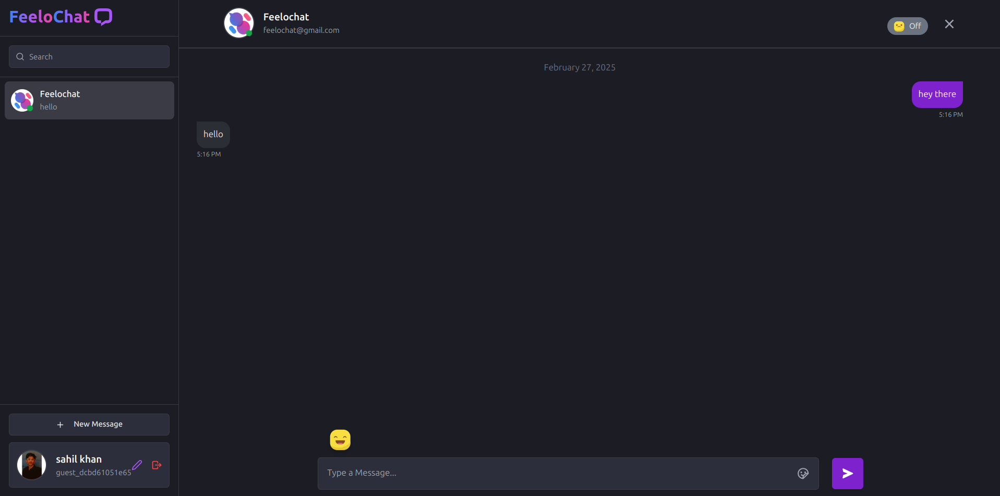
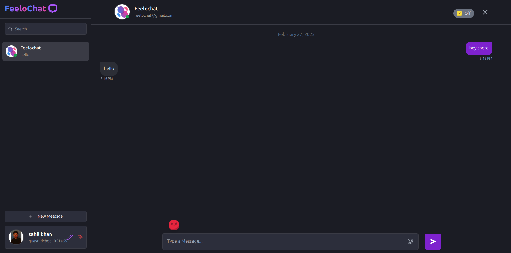
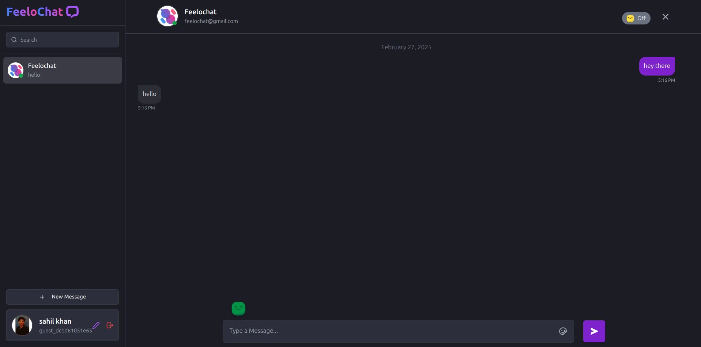

# FeeloChat

FeeloChat is a **privacy-focused, end-to-end encrypted** chat application that goes beyond text-based communication. It integrates **Face API.js** to detect and share facial expressions in real-time, allowing users to express their emotions more authentically while chatting.

With FeeloChat, your conversations remain **secure and private**, as expression detection happens **locally on your device** before being shared. This ensures that your facial data is never stored or sent to external servers. The app is designed to work seamlessly across **mobile and desktop devices**, supporting all screen resolutions.

## Features

✅ **End-to-End Encryption** – Ensuring private and secure conversations.
✅ **Real-time Expression Sharing** – Communicate emotions along with messages.
✅ **Face API.js Integration** – Expressions detected locally, ensuring privacy.
✅ **Multi-Device Support** – Optimized for both mobile and desktop.
✅ **User-Friendly Interface** – Clean, intuitive, and easy to use.

## Preview

Here are some screenshots of FeeloChat in action:

### Sign Up & Profile

### Chat Interface

### Expressions

