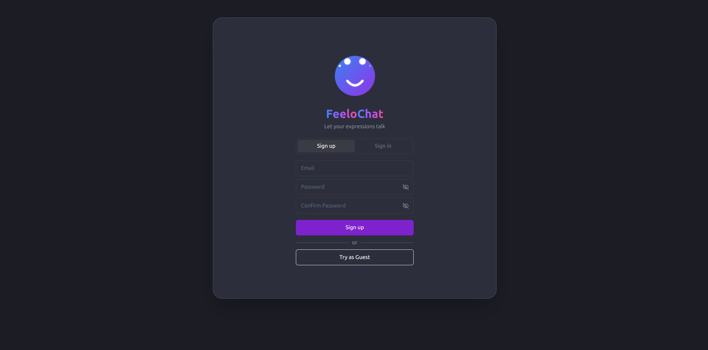
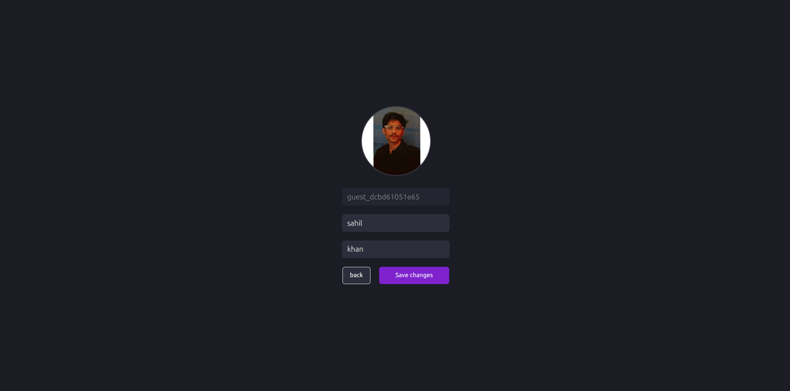
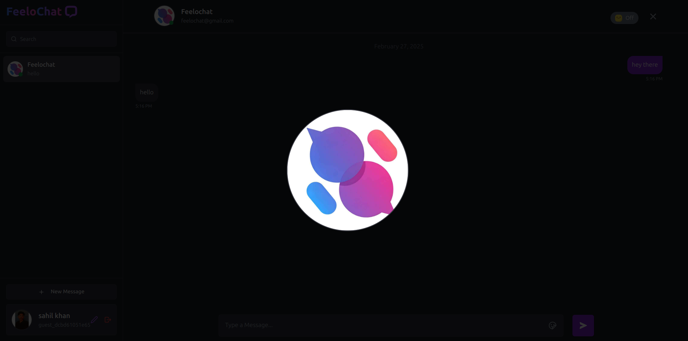
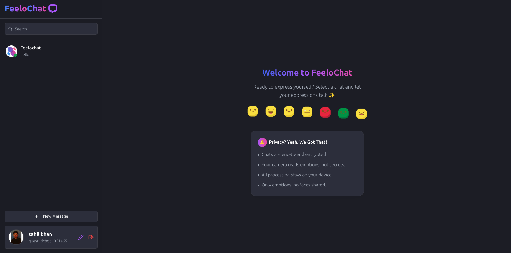
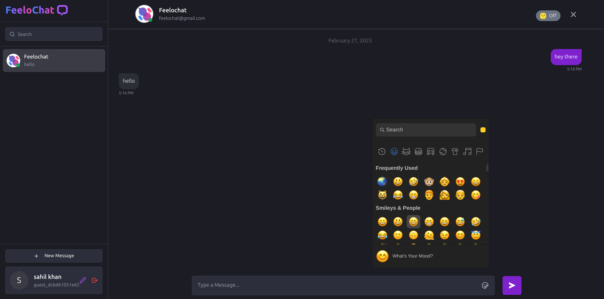
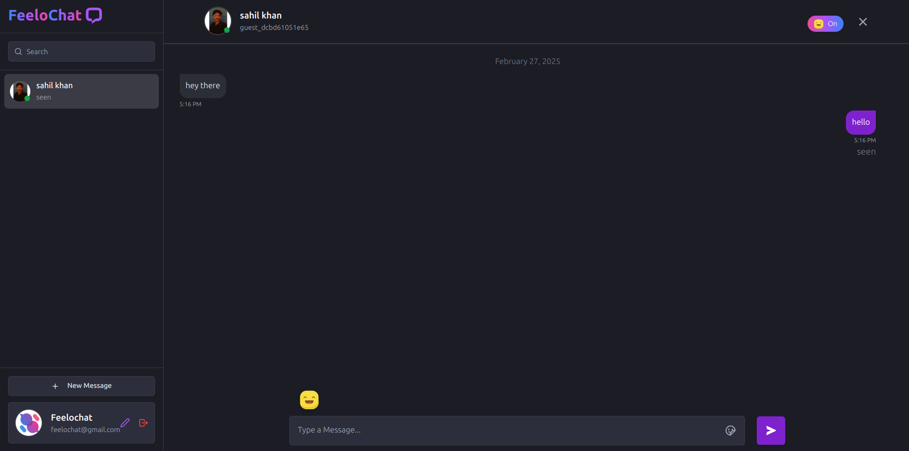
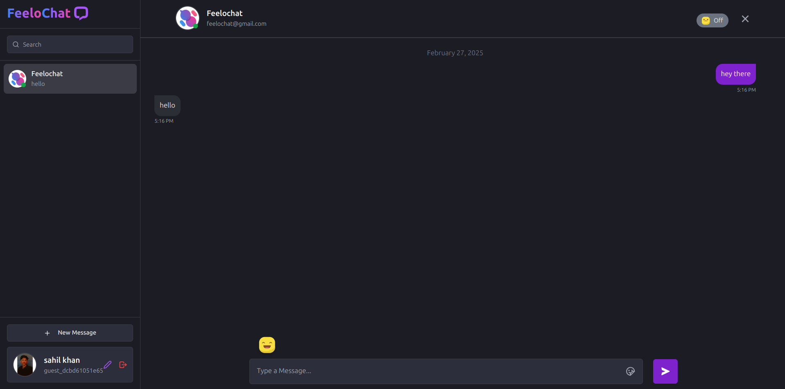
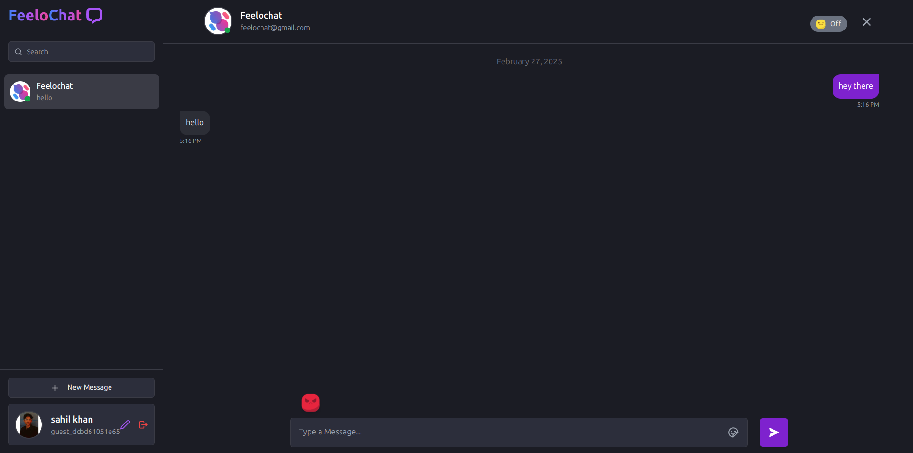
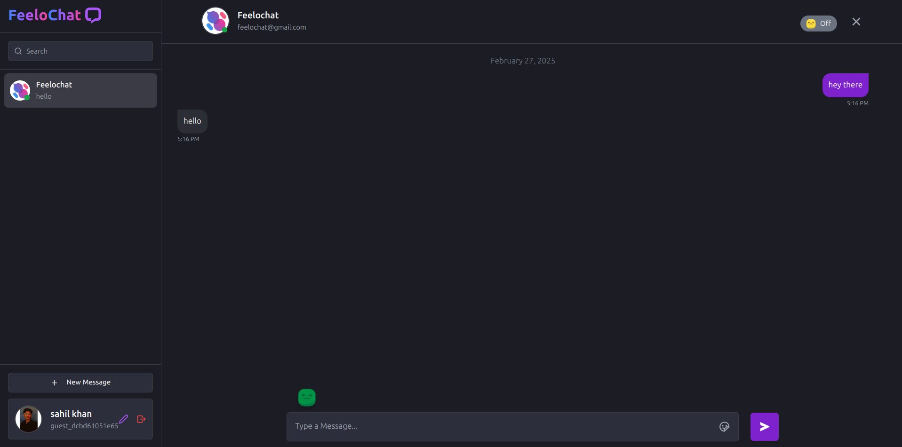

# FeeloChat

FeeloChat is a **privacy-focused, end-to-end encrypted** chat application that goes beyond text-based communication. It integrates **Face API.js** to detect and share facial expressions in real-time, allowing users to express their emotions more authentically while chatting.

With FeeloChat, your conversations remain **secure and private**, as expression detection happens **locally on your device** before being shared. This ensures that your facial data is never stored or sent to external servers. The app is designed to work seamlessly across **mobile and desktop devices**, supporting all screen resolutions.

## Features

✅ **End-to-End Encryption** – Ensuring private and secure conversations.
✅ **Real-time Expression Sharing** – Communicate emotions along with messages.
✅ **Face API.js Integration** – Expressions detected locally, ensuring privacy.
✅ **Multi-Device Support** – Optimized for both mobile and desktop.
✅ **User-Friendly Interface** – Clean, intuitive, and easy to use.

## Preview

Here are some screenshots of FeeloChat in action:

### Sign Up & Profile




### Chat Interface




### Expressions






## Installation

Follow these steps to set up FeeloChat on your local machine:

### Prerequisites

- **Node.js** (Latest LTS version recommended)
- **MongoDB** (For storing user data and messages)

### Clone the Repository

```bash
git clone https://github.com/yourusername/feelochat.git
cd feelochat
```

### Backend Setup

```bash
cd backend
npm install
npm start
```

### Frontend Setup

```bash
cd frontend
npm install
npm run dev
```

## Project Structure

```
feelochat/
├── frontend/        # Frontend code (React, Face API.js)
│   ├── src/
│   │   ├── assets/  # Images & icons
│   │   ├── components/
│   │   ├── pages/
│   ├── package.json
│   ├── vite.config.js
│
├── backend/         # Backend code (Node.js, Express, MongoDB)
│   ├── routes/
│   ├── models/
│   ├── controllers/
│   ├── config/
│   ├── server.js
│   ├── package.json
│
├── README.md        # Project documentation
```

## Contribution

Contributions are welcome! If you'd like to contribute:

1. Fork the repository
2. Create a new branch (`git checkout -b feature-branch`)
3. Make your changes and commit them
4. Push to your fork and submit a pull request

## License

FeeloChat is **open-source** and licensed under the MIT License.

---

Feel free to suggest improvements or report issues in the repository!

*Happy Chatting! 🎉*
